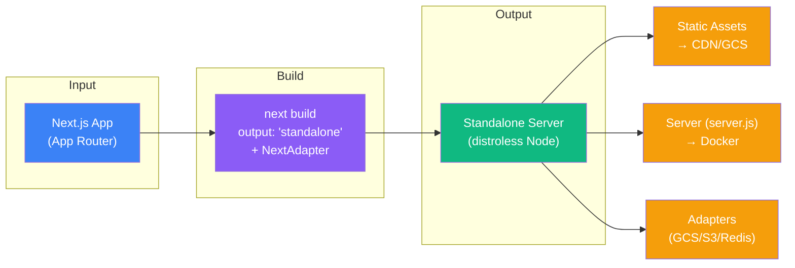
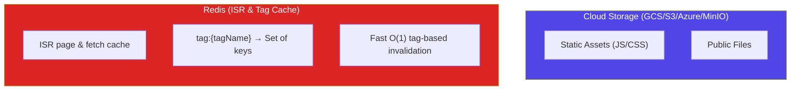
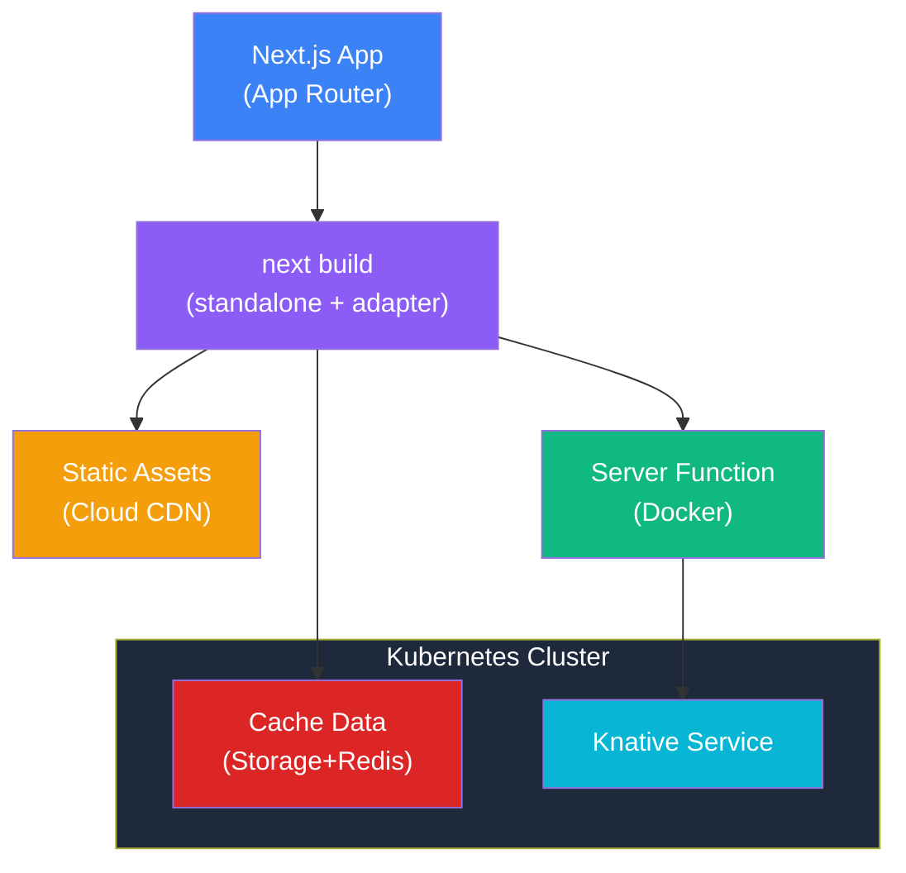

# kn-next: Cloud-Native Next.js for Knative

> **Production-ready framework for deploying Next.js applications on Knative with Fluid Compute characteristics.**

Built on the **official Next.js Adapter API** with `output: 'standalone'` — no forks, no vendor build tools — for serverless compatibility with distributed caching (Redis). Runs natively on **Node 20+** (and Bun), with Vercel-Fluid-style cold-start bytecode caching.

---

## Table of Contents

- [Why Knative?](#why-knative)
- [How It Works: Next.js Adapter](#how-it-works-nextjs-adapter)
- [Features](#features)
- [Quick Start](#quick-start)
- [Configuration Reference](#configuration-reference)
- [Caching & Adapters](#caching--adapters)
- [Multi-Cloud Deployment](#multi-cloud-deployment)
- [Architecture](#architecture)
- [File Manager Demo](#file-manager-demo)
- [Development](#development)

---

## Why Knative?

**Knative** is a Kubernetes-based platform that provides serverless capabilities without lock-in to any specific cloud provider. Unlike AWS Lambda or Vercel's Edge Functions, Knative runs on **any Kubernetes cluster** (GKE, EKS, AKS, or on-premise).

### Benefits

| Feature | Lambda/Vercel | Knative |
|---------|--------------|---------|
| **Portability** | Vendor-locked | Any Kubernetes cluster (portable by design; GKE/kind-verified, other clouds tracked in [#46](https://github.com/getknext-dev/knext/issues/46)) |
| **Scale-to-Zero** | ✅ | ✅ |
| **Autoscaling** | Managed | Configurable (KPA/HPA) |
| **Cold Starts** | ~200-500ms | **< 1s** with V8 bytecode cache (`NODE_COMPILE_CACHE`) + Knative caching |
| **Container Control** | Limited | Full Docker access |
| **Networking** | Platform-managed | Full K8s networking |
| **Cost Model** | Per-invocation | Per-pod-second |

### Use Cases

- **Multi-cloud deployments** requiring platform portability
- **On-premise** or **air-gapped** environments
- **Low-latency** applications needing `minScale: 1` (no cold starts)
- **Hybrid architectures** with existing Kubernetes workloads
- **Cost optimization** for high-traffic applications

---

## How It Works: Next.js Adapter

kn-next integrates via the **official Next.js Adapter API** (`NextAdapter`), registered through `experimental.adapterPath`. A standard `next build` with `output: 'standalone'` produces a self-contained Node server; the adapter hooks into the build to wire Knative-specific behavior — no custom compiler, no fork of Next.js.

### Build Pipeline



### What the Adapter Does

1. **`modifyConfig`** → forces `output: 'standalone'` and injects the Redis `cacheHandler` at build time
2. **`onBuildComplete`** → uploads `staticFiles` + `prerenders` to cloud storage, keyed by `buildId`
3. **Standalone server** → `next build` emits a self-contained `server.js` that runs on plain **Node 20+** (and Bun via `node:http` compat) — no bundler-specific runtime
4. **Cold-start bytecode caching** → `NODE_COMPILE_CACHE` persists the V8 code cache so scaled-from-zero pods skip re-compilation (the mechanism behind Vercel Fluid)

---

## Features

- ✅ **Official Next.js Adapter API** – `next build` standalone, no fork, runs on Node 20+ and Bun
- ✅ **V8 Bytecode Caching** – `NODE_COMPILE_CACHE` on a shared volume for sub-second cold starts (Vercel-Fluid-style)
- ✅ **Fluid Compute** – Scale-to-zero, high concurrency, auto-scaling
- ✅ **Distributed Caching** – Redis-backed caching with automatic tag invalidation
- 🟡 **Portable by design** – GKE/kind-verified; portable to EKS/AKS/OKE or any Kubernetes by design (2nd-cloud verification tracked in [#46](https://github.com/getknext-dev/knext/issues/46)). See [Multi-Cloud Portability](docs/operator/multi-cloud-portability.md)
- ✅ **Cache Monitoring** – Built-in cache event dashboard
- ✅ **Single-Command Deploy** – Automated build, push, and deploy
- ✅ **Monorepo Ready** – Turborepo for efficient builds
- ✅ **Kubernetes Operator** – Declarative `NextApp` CRD for GitOps-style deployment

> **What Next.js features does knext support?** See the evidence-gated
> [compatibility matrix](docs/compat-matrix.md) — every ✅ is backed by the per-PR `compat-smoke`
> gate or test-covered source, and a guard test fails CI on any overclaim. (knext does **not** yet
> pass the official Next.js compatibility suite; that is tracked separately.)

---

## Performance Benchmarks

> Benchmarks measured on Knative Serving with scale-to-zero (`minScale: 0`) on GKE.
> Cold start speed is achieved through **Knative resource caching** and **V8 bytecode caching** (`NODE_COMPILE_CACHE` on a shared volume).

### Cold Start Performance (Scale from Zero)

With `minScale: 0`, pods terminate after 10 seconds of inactivity and must be provisioned fresh on next request:

| Metric | Value |
|--------|-------|
| **Time to First Byte (TTFB)** | **0.66s** |
| **Total Response Time** | **0.92s** |
| **Pod Provisioning** | Container goes from `Pending → Running` in ~1s |

### Warm Start Performance

| Metric | Value |
|--------|-------|
| **Time to First Byte (TTFB)** | **0.58s** |
| **Total Response Time** | **0.80s** |

### Load Testing (100K Requests)

```bash
seq 1 100000 | xargs -n1 -P100 -I {} curl -s -o /dev/null -w "%{time_total}\n" \
  "http://file-manager.default.136.111.227.195.sslip.io/audit"
```

| Metric | Value |
|--------|-------|
| **Total Requests** | 100,000 |
| **Concurrency** | 100 parallel workers |
| **Average Response Time** | **0.521s** |
| **Requests/Second (RPS)** | **~192 req/s** |
| **Per-Pod RPS** | ~96 req/s (with `maxScale: 2`) |
| **Total Test Duration** | ~521s (~8.7 min) |
| **Error Rate** | 0% (all requests successful) |

### Why Sub-Second Cold Starts?

The Dockerfile uses a **2-stage build** producing a lean distroless Node image:

1. **Build Stage** – `node:22` + `pnpm` runs `next build` (`output: 'standalone'`) → self-contained `server.js`
2. **Runtime Stage** – `gcr.io/distroless/nodejs22` runs the standalone server with `NODE_COMPILE_CACHE` pointed at a shared volume

On the first request a pod compiles its JavaScript and writes the V8 code cache to the volume; subsequent cold-started pods deserialize that cache instead of re-parsing/JIT-compiling — the same approach Vercel Fluid uses. In production the [kn-next operator](./docs/operator/README.md) mounts this cache on a PVC (`spec.cache.enableBytecodeCache`) so it survives scale-to-zero. Combined with Knative's resource caching, this achieves consistent sub-second cold starts even with `minScale: 0`.

---

## Quick Start

> **New to knext?** Follow the step-by-step **[Quickstart guide](./docs/QUICKSTART.md)** —
> from an empty cluster (operator install included) to a deployed, scale-to-zero app.

### Prerequisites

- Node.js 22.18+ (24 LTS recommended) or Bun 1.2+
- Docker with buildx
- kubectl configured for your cluster
- Cloud storage bucket (GCS/S3/Azure/MinIO)
- Redis instance (optional, for cache invalidation)

### 1. Install Dependencies

```bash
pnpm install
```

### 2. Configure Your App

Create `kn-next.config.ts` in your app directory:

```typescript
import type { KnativeNextConfig } from '@kn-next/config';

const config: KnativeNextConfig = {
  name: 'my-app',
  
  // Storage for static assets
  storage: {
    provider: 'gcs',           // 'gcs' | 's3' | 'azure' | 'minio'
    bucket: 'my-assets-bucket',
    publicUrl: 'https://storage.googleapis.com/my-assets-bucket',
  },
  
  // Cache for fast tag-based invalidation
  cache: {
    provider: 'redis',
    url: 'redis://redis.default.svc.cluster.local:6379',
    keyPrefix: 'my-app',
  },
  
  // Container registry
  registry: 'gcr.io/my-project',
  
  // Knative autoscaling
  scaling: {
    minScale: 1,   // Keep 1 pod always running (no cold starts)
    maxScale: 10,  // Scale up to 10 pods
  },
};

export default config;
```

### 3. Deploy

```bash
# Using the deploy script
./deploy.sh

# Or using the CLI
npx kn-next deploy
```

This single command:
1. Runs `next build` (`output: 'standalone'`) with the kn-next adapter
2. Syncs static assets + prerenders to cloud storage (keyed by `buildId`)
3. Builds & pushes the distroless Node Docker image
4. Generates the Knative manifest
5. Deploys to cluster

---

## Configuration Reference

### Complete Configuration Schema

```typescript
interface KnativeNextConfig {
  // Required: Application name (used for K8s resources)
  name: string;
  
  // Required: Container registry URL
  registry: string;
  
  // Required: Storage configuration
  storage: StorageConfig;
  
  // Optional: Cache configuration (default: none)
  cache?: CacheConfig;
  
  // Optional: ISR revalidation queue (default: none)
  queue?: QueueConfig;
  
  // Optional: Deploy infrastructure services alongside app
  infrastructure?: InfrastructureConfig;
  
  // Optional: Knative autoscaling settings
  scaling?: ScalingConfig;
}
```

### Storage Providers

Configure where static assets are stored:

```typescript
// Google Cloud Storage
storage: {
  provider: 'gcs',
  bucket: 'my-bucket',
  publicUrl: 'https://storage.googleapis.com/my-bucket',
}

// AWS S3
storage: {
  provider: 's3',
  bucket: 'my-bucket',
  region: 'us-east-1',
  publicUrl: 'https://my-bucket.s3.amazonaws.com',
}

// Azure Blob Storage
storage: {
  provider: 'azure',
  bucket: 'my-container',  // container name
  region: 'eastus',
}

// MinIO (S3-compatible, self-hosted)
storage: {
  provider: 'minio',
  bucket: 'my-bucket',
  endpoint: 'http://minio.default.svc.cluster.local:9000',
  accessKey: 'minioadmin',
  secretKey: 'minioadmin',
}
```

### Cache Providers

Configure distributed cache for tag-based invalidation:

```typescript
// Redis (recommended)
cache: {
  provider: 'redis',
  url: 'redis://redis:6379',
  keyPrefix: 'my-app',    // Optional namespace
  tls: true,              // Enable TLS
}

// DynamoDB (AWS)
cache: {
  provider: 'dynamodb',
  tableName: 'my-app-cache',
  region: 'us-east-1',
}
```

### Queue Providers (ISR Revalidation)

Configure background revalidation queue:

```typescript
// Kafka (Knative Eventing compatible)
queue: {
  provider: 'kafka',
  brokerUrl: 'kafka:9092',
  topic: 'my-app-revalidation',
}

// No queue (synchronous revalidation)
queue: {
  provider: 'none',
}
```

### Infrastructure Services

Auto-deploy PostgreSQL, Redis, or MinIO alongside your app:

```typescript
infrastructure: {
  postgres: {
    enabled: true,
    version: '16',
    storage: '10Gi',
  },
  redis: {
    enabled: true,
    version: '7',
  },
  minio: {
    enabled: true,
    storage: '20Gi',
    accessKey: 'admin',
    secretKey: 'secretpassword',
  },
}
```

### Scaling Configuration

```typescript
scaling: {
  minScale: 0,   // Scale to zero (save costs, but cold starts)
  maxScale: 10,  // Maximum pods
}

// For low-latency requirements
scaling: {
  minScale: 1,   // Always keep 1 pod running
}
```

---

## Caching & Adapters

### Two-Tier Cache Architecture



### Available Adapters

| Adapter | File | Purpose |
|---------|------|---------|
| **Node Server** | `node-server.ts` | HTTP server wrapper for Knative |
| **Bytecode Metrics** | `bytecode-metrics.ts` | Prometheus metrics for the node server |

### Cache Invalidation API

```bash
# Invalidate by tag
curl -X POST http://your-app/api/cache/invalidate \
  -H "Content-Type: application/json" \
  -d '{"tag": "products"}'

# Response
{
  "success": true,
  "message": "Cache invalidated for tag: products",
  "timestamp": "2026-02-05T10:00:00.000Z"
}
```

### Real-time Cache Events

Connect to `/api/cache/events` for Server-Sent Events:

```typescript
const events = new EventSource('/api/cache/events');

events.onmessage = (e) => {
  const event = JSON.parse(e.data);
  // { type: 'HIT', source: 'redis', key: '/products', durationMs: 2 }
};
```

---

## Multi-Cloud Deployment

> **Verification status:** knext is **portable by design**, but end-to-end deploys are
> currently **verified on GKE and kind only**. The EKS/AKS/OKE examples below are
> design-correct configurations, not yet validated on a live 2nd cloud — that
> verification is tracked in [#46](https://github.com/getknext-dev/knext/issues/46).
> Before deploying to a non-GKE cluster, read
> **[Multi-Cloud Portability](docs/operator/multi-cloud-portability.md)** for the
> per-cloud prerequisites (ingress-class, StorageClass, LoadBalancer/gateway IP, and
> build-host CLI tools).

### Google Cloud (GKE)

```typescript
const config: KnativeNextConfig = {
  name: 'my-app',
  storage: {
    provider: 'gcs',
    bucket: 'my-gcs-bucket',
    publicUrl: 'https://storage.googleapis.com/my-gcs-bucket',
  },
  cache: {
    provider: 'redis',
    url: 'redis://redis.default.svc.cluster.local:6379',
  },
  registry: 'gcr.io/my-project',
};
```

**GKE Prerequisites:**
```bash
# Ensure GCS write access (one of these)
gcloud container node-pools create storage-enabled \
  --scopes="gke-default,storage-full"

# Or use Workload Identity for production
gcloud iam service-accounts add-iam-policy-binding ...
```

### AWS (EKS)

```typescript
const config: KnativeNextConfig = {
  name: 'my-app',
  storage: {
    provider: 's3',
    bucket: 'my-s3-bucket',
    region: 'us-east-1',
    publicUrl: 'https://my-s3-bucket.s3.amazonaws.com',
  },
  cache: {
    provider: 'redis',
    url: 'redis://my-elasticache.xxx.cache.amazonaws.com:6379',
    tls: true,
  },
  registry: '123456789.dkr.ecr.us-east-1.amazonaws.com',
};
```

**EKS Prerequisites:**
```bash
# Configure IAM roles for S3 access
eksctl create iamserviceaccount \
  --name default \
  --namespace default \
  --cluster my-cluster \
  --attach-policy-arn arn:aws:iam::aws:policy/AmazonS3FullAccess
```

### Azure (AKS)

```typescript
const config: KnativeNextConfig = {
  name: 'my-app',
  storage: {
    provider: 'azure',
    bucket: 'my-container',
    region: 'eastus',
  },
  cache: {
    provider: 'redis',
    url: 'redis://my-redis.redis.cache.windows.net:6380',
    tls: true,
  },
  registry: 'myregistry.azurecr.io',
};
```

### On-Premise / MinIO

```typescript
const config: KnativeNextConfig = {
  name: 'my-app',
  storage: {
    provider: 'minio',
    bucket: 'assets',
    endpoint: 'http://minio.storage.svc.cluster.local:9000',
    accessKey: process.env.MINIO_ACCESS_KEY,
    secretKey: process.env.MINIO_SECRET_KEY,
  },
  cache: {
    provider: 'redis',
    url: 'redis://redis.cache.svc.cluster.local:6379',
  },
  registry: 'registry.internal.local:5000',
  infrastructure: {
    minio: { enabled: true, storage: '50Gi' },
    redis: { enabled: true },
  },
};
```

---

## Architecture

See [docs/ARCHITECTURE.md](./docs/ARCHITECTURE.md) for detailed diagrams including:
- System architecture (Mermaid)
- Request/response flow
- Cache invalidation flow
- Deployment pipeline

### High-Level Overview



### Project Structure

```
├── apps/
│   └── file-manager/           # Example Next.js 16 app
│       ├── kn-next.config.ts   # App configuration
│       ├── deploy.sh           # Deployment script
│       └── src/app/            # App Router pages
│
├── packages/
│   ├── kn-next/                # Core framework package
│   │   ├── src/adapters/       # GCS, Redis, Kafka adapters
│   │   ├── src/generators/     # Manifest generators
│   │   └── src/cli/            # CLI tools (build, deploy)
│   └── lib/                    # Shared utilities
│
└── docs/
    └── ARCHITECTURE.md         # Detailed architecture
```

---

## File Manager Demo

The example app demonstrates all framework capabilities:

- File upload/download with MinIO/GCS
- PostgreSQL metadata storage
- Real-time cache monitoring
- Paginated audit logs with infinite scroll
- Tag-based cache invalidation
- **Cache testing playground** with various strategies

### Demo Pages

| Page | URL | Description |
|------|-----|-------------|
| Home | `/` | File listing |
| Dashboard | `/dashboard` | Statistics |
| Audit Logs | `/audit` | Activity log |
| Cache Monitor | `/cache` | Real-time events |
| **Cache Tests** | `/cache-tests` | Testing playground |

### Cache Testing Playground

| Test | URL | Strategy |
|------|-----|----------|
| Time-based | `/cache-tests/time-based` | `revalidate: 60` |
| On-demand | `/cache-tests/on-demand` | `revalidateTag()` |
| Fetch cache | `/cache-tests/fetch-cache` | `force-cache` |
| Parallel | `/cache-tests/parallel` | Concurrent fetches |
| Nested | `/cache-tests/nested` | Layout caching |
| Dynamic/Static | `/cache-tests/dynamic-static` | Rendering modes |

---

## Development

### Local Development

```bash
cd apps/file-manager
pnpm dev
```

### Build & Deploy

```bash
# Full deployment with defaults
npx kn-next deploy

# Or step-by-step
npx kn-next build       # next build (standalone) + adapter
npx kn-next deploy      # Deploy to cluster
npx kn-next cleanup     # Remove from cluster
```

### CLI Reference

```bash
npx kn-next deploy [options]
```

| Option | Short | Description |
|--------|-------|-------------|
| `--registry <url>` | `-r` | Override container registry |
| `--bucket <name>` | `-b` | Override storage bucket |
| `--tag <tag>` | `-t` | Image tag (default: timestamp) |
| `--namespace <ns>` | `-n` | Kubernetes namespace (default: default) |
| `--skip-build` | | Skip the `next build` step |
| `--skip-upload` | | Skip asset upload to storage |
| `--skip-infra` | | Skip infrastructure deployment |
| `--dry-run` | | Generate manifests without deploying |
| `--help` | `-h` | Show help |

### Environment Variables (CI/CD)

These environment variables can be used instead of CLI flags:

| Variable | Description |
|----------|-------------|
| `KN_REGISTRY` | Container registry URL |
| `KN_BUCKET` | Storage bucket name |
| `KN_IMAGE_TAG` | Docker image tag |
| `KN_NAMESPACE` | Kubernetes namespace |
| `KN_REDIS_URL` | Redis connection URL (overrides config) |
| `KN_DATABASE_URL` | Database connection URL (overrides config) |

### CI/CD Examples

**GitHub Actions:**
```yaml
- name: Deploy to Knative
  env:
    KN_REGISTRY: gcr.io/${{ secrets.GCP_PROJECT }}
    KN_IMAGE_TAG: ${{ github.sha }}
    KN_NAMESPACE: production
    KN_REDIS_URL: ${{ secrets.REDIS_URL }}
    KN_DATABASE_URL: ${{ secrets.DATABASE_URL }}
  run: npx kn-next deploy
```

**GitLab CI:**
```yaml
deploy:
  script:
    - npx kn-next deploy --tag $CI_COMMIT_SHA --namespace production
  variables:
    KN_REGISTRY: gcr.io/my-project
    KN_REDIS_URL: $REDIS_URL
```

**Production with specific tag:**
```bash
npx kn-next deploy --tag v1.2.3 --namespace production
```

**Preview manifest only:**
```bash
npx kn-next deploy --dry-run
```

---

## License

[Apache License 2.0](./LICENSE) — consistent with the Go operator source headers and the
Knative/Kubernetes ecosystem this project builds on. The Apache-2.0 patent grant matters for an
infrastructure project intended for production adoption.
