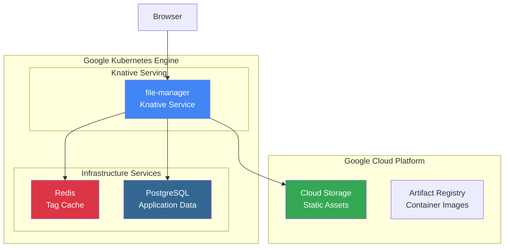
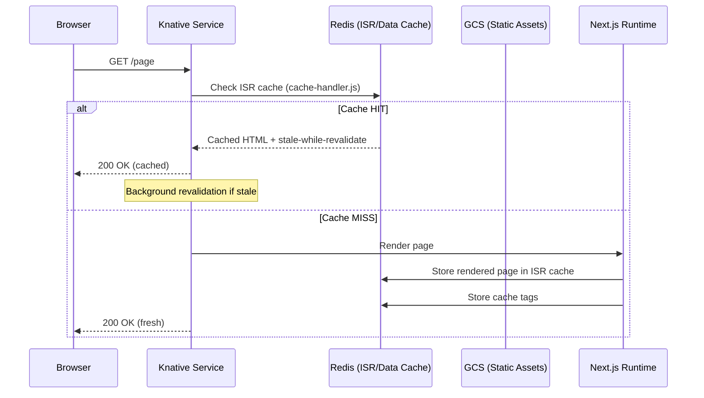
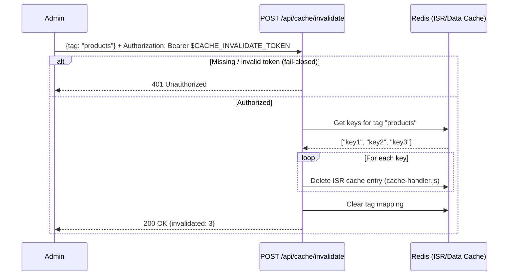
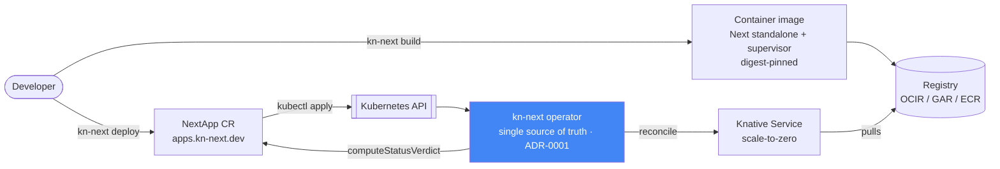
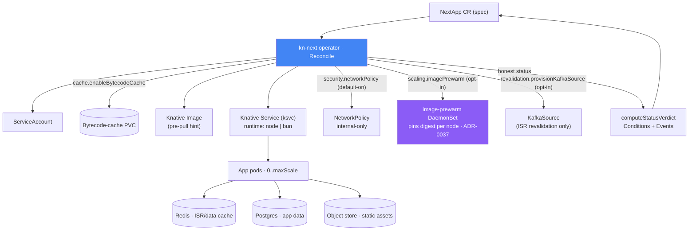
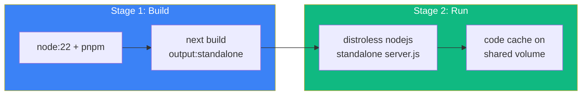
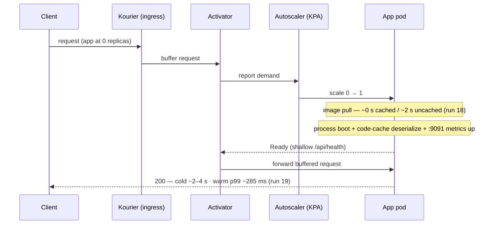
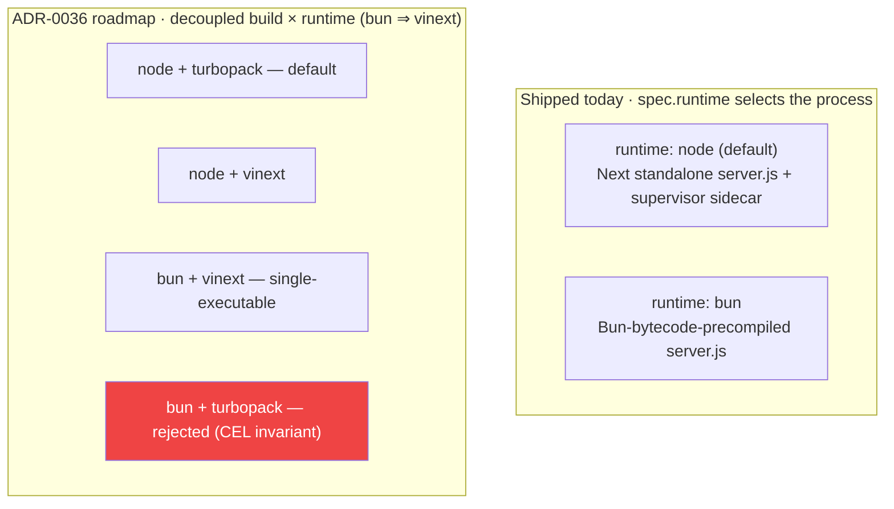

# Knative Next.js Architecture

## Overview

This framework enables deploying Next.js applications as Knative services on GKE with Fluid Compute characteristics. It uses the **official Next.js Deployment Adapter API** (top-level `adapterPath` config on Next.js 16.2+; `experimental.adapterPath` on 16.0.x–16.1.x) with `output:'standalone'` to produce a self-contained Node.js server, while providing pluggable adapters for storage, caching, and messaging.

## System Architecture



## Key Components

### 1. Official Next.js Adapter (`output:'standalone'`)

`next build` with `output:'standalone'` and `adapterPath` (top-level at Next.js 16.2+; under `experimental` on 16.0.x–16.1.x) produces:

```text
.next/
├── standalone/          # Self-contained Node.js server (copied to Docker image)
│   └── server.js        # Entry point — starts the Next.js HTTP server
├── static/              # Client-side JS/CSS/fonts → uploaded to GCS
└── cache/               # Build-time pre-rendered pages
```

The `next-adapter.ts` (`NextAdapter`) hooks into `modifyConfig` (enforce standalone) and
`onBuildComplete` (upload static assets to object storage keyed by `buildId`).

### 2. kn-next Package

The `@kn-next/config` package provides pluggable adapters:

| Adapter | Purpose | Implementation |
| --------- | --------- | ---------------- |
| **GCS Storage** | Static assets only (NOT ISR) | — |
| **Redis Cache** | ISR/data cache + tag invalidation | `cache-handler.js` |
| **Kafka Queue** | Revalidation queue | `kafka-queue.ts` |
| **Node Server** | HTTP server wrapper | `node-server.ts` |

### 3. Configuration System

```text
kn-next.config.ts           # User configuration
        ↓
    kn-next build
        ↓
```

**Example `kn-next.config.ts`:**

```typescript
const config: KnativeNextConfig = {
    name: 'file-manager',
    storage: {
        provider: 'gcs',
        bucket: 'knative-next-assets-banna',
        publicUrl: 'https://storage.googleapis.com/knative-next-assets-banna',
    },
    cache: {
        provider: 'redis',
        url: 'redis://redis.default.svc.cluster.local:6379',
        keyPrefix: 'file-manager',
    },
    registry: 'us-central1-docker.pkg.dev/gsw-mcp/knative-next-repo',
};
```

## Data Flow

### Request Flow



### Cache Invalidation Flow



> Both mutating cache routes (`POST /api/cache/invalidate`, `DELETE /api/cache/events`)
> require a Bearer token (`CACHE_INVALIDATE_TOKEN`) and **fail closed** when it is unset —
> see `docs/security/mutating-endpoints.md`.

## Deployment Pipeline

`kn-next` builds an image and emits a **`NextApp` custom resource**; the operator
reconciles the cluster from it. The CLI never applies raw Knative manifests — per
**ADR-0001 the operator is the single source of truth** for cluster state
(`deploy.ts` builds → pushes → applies the CR).



### Control plane: what the operator reconciles from one `NextApp`

Every cluster mutation flows from the CR through `Reconcile`. Cross-cutting
optional features are gated by `spec` flags; all honest status
(`Conditions` + `Events`) is computed centrally in `computeStatusVerdict`, never
in ad-hoc `Reconcile` branches.



**BUILD_ID Synchronization:**

The BUILD_ID ensures server and client assets are always in sync:

- Docker image tagged: `file-manager:build-{BUILD_ID}`
- Static assets in GCS: `gs://bucket/{appName}/_next/static/{BUILD_ID}/`
  (assets are **app-namespaced** under `{appName}/` — #74 — so a shared bucket
  isolates zones and the operator's deletion finalizer can delete exactly this
  app's keys; served via `assetPrefix = {publicUrl}/{appName}`)
- Both reference the same BUILD_ID at runtime

## Caching Architecture

### Two-Tier Cache

```text
┌─────────────────────────────────────────────────────┐
│              Redis (ISR / Data Cache)               │
│  - ISR page cache (cache-handler.js)                │
│  - Fetch cache                                      │
│  - Tag → Keys mapping for invalidation              │
│  Keyed by: {prefix}/{key}                           │
└─────────────────────────────────────────────────────┘

┌─────────────────────────────────────────────────────┐
│              GCS (Static Assets only)               │
│  - _next/static/ (JS, CSS, fonts)                  │
│  - Uploaded at build time keyed by buildId          │
│  NOT used for ISR/data cache (that is Redis)        │
└─────────────────────────────────────────────────────┘
```

> **Correction from earlier docs:** GCS holds **static assets only**. The ISR/data cache
> (`cache-handler.js`) is backed by **Redis** (the only implemented data-cache provider). Static
> assets upload to GCS/S3/MinIO/Azure Blob via each cloud's CLI (`gsutil`/`aws`/`mc`/`az`). The
> former DynamoDB cache surface was trimmed (never had a runtime); `spec.revalidation.kafka` is
> ISR-revalidation wiring only.

### Cache Events (Observability)

The cache system emits real-time events via SSE:

```typescript
// Server-Sent Events at /api/cache/events
interface CacheEvent {
    type: 'HIT' | 'MISS' | 'SET' | 'DELETE' | 'REVALIDATE';
    layer: 'gcs' | 'redis';
    key: string;
    timestamp: number;
    durationMs?: number;
    details?: string;
}
```

## Database layer (scale-zero-pg)

knext is **two scale-to-zero layers on one cluster**: the application layer described above
(Next.js on Knative), and a **database layer** —
[scale-zero-pg](https://github.com/getknext-dev/scale-zero-pg) (v1.0.0 GA) — that scales
PostgreSQL to zero and wakes it on the first client connection. An app and its database can
sleep at zero and **wake together on one visitor request**.

The two layers wake by **different mechanisms, by necessity**: knext apps wake through
Knative's **HTTP** activator, while databases wake through scale-zero-pg's **TCP**
wake-on-connect gateway — Knative's activator is HTTP-only and cannot wake on a raw Postgres
connection, which is precisely why the database layer is a separate, purpose-built component.

The integration seam is **one Secret**: the `DATABASE_URL` above, mapped from a Kubernetes
Secret via `NextApp.spec.secrets.envMap`. knext builds no database machinery; scale-zero-pg
ships alongside as cluster infrastructure. See the
[database-layer guide](guides/database-platform.md) for the full picture, and scale-zero-pg's
[getting-started](https://github.com/getknext-dev/scale-zero-pg/blob/main/docs/getting-started.md)
and [connecting](https://github.com/getknext-dev/scale-zero-pg/blob/main/docs/connecting.md)
for the DSN, tier table, pooling rules, and per-app (branch-per-app) provisioning.

## Environment Variables

The environment variables depend on your chosen storage and cache providers.

**Core (all deployments):**

| Variable | Description | Default |
| ---------- | ------------- | --------- |
| `NODE_ENV` | Runtime environment | `production` |
| `NEXT_BUILD_ID` | From `next build` | Auto |
| `DATABASE_URL` | PostgreSQL connection (see [Database layer](#database-layer-scale-zero-pg)) | Required |
| `NODE_COMPILE_CACHE` | V8 bytecode cache path | Optional |

**Cache (Redis):**

| Variable | Description | Default |
| ---------- | ------------- | --------- |
| `REDIS_URL` | Redis connection URL | Required |
| `REDIS_KEY_PREFIX` | Cache key namespace | App name |

**Storage (provider-specific):**

| Variable | Provider | Description |
| ---------- | ---------- | ------------- |
| `GCS_BUCKET_NAME` | GCS | Bucket name |
| `GOOGLE_APPLICATION_CREDENTIALS` | GCS | SA key path (or use ADC) |
| `S3_BUCKET_NAME` | S3 | Bucket name |
| `AWS_REGION` | S3 | AWS region |
| `AZURE_STORAGE_ACCOUNT` | Azure | Storage account |
| `MINIO_ENDPOINT` | MinIO | MinIO endpoint URL |
| `MINIO_ACCESS_KEY` | MinIO | Access key |
| `MINIO_SECRET_KEY` | MinIO | Secret key |

## API Endpoints

| Endpoint | Method | Description |
| ---------- | -------- | ------------- |
| `/api/health` | GET | Shallow readiness/liveness (no DB dial) — backs Knative probes |
| `/api/health/deep` | GET | Deep dependency reachability — observability/alerting only |
| `/api/audit` | GET | Paginated audit logs |
| `/api/cache-stats` | GET | Cache statistics |
| `/api/cache/events` | GET | SSE cache events stream |
| `/api/cache/invalidate` | POST | Invalidate by tag |

## Project Structure

```text
knative-next-monorepo/
├── apps/
│   └── file-manager/           # Example Next.js 16 application
│       ├── kn-next.config.ts   # App configuration
│       ├── deploy.sh           # Deployment automation
│       ├── knative-service.yaml
│       └── src/app/            # App Router pages
│
├── packages/
│   ├── kn-next/                # Core framework package
│   │   └── src/
│   │       ├── adapters/       # Cache & queue adapters
│   │       ├── config.ts       # Config type definitions
│   │       └── loader.ts       # Runtime loader
│   │
│   └── lib/                    # Shared utilities
│       └── src/clients.ts      # DB/storage clients
│
├── docs/
│   └── ARCHITECTURE.md         # This document
│
└── README.md
```

## Knative Configuration

**Key Settings:**

```yaml
autoscaling.knative.dev/minScale: "1"      # Always-on (avoid cold starts)
autoscaling.knative.dev/maxScale: "5"      # Max replicas
autoscaling.knative.dev/target: "100"      # Concurrent requests per pod
```

**Volume Mounts for GCS:**

```yaml
volumeMounts:
  - name: gcs-credentials
    mountPath: /secrets/gcs
    readOnly: true
volumes:
  - name: gcs-credentials
    secret:
      secretName: gcs-credentials
```

## Cold Start Optimization & Bytecode/Transpiler Caching

Knative scale-to-zero services incur a cold start cost each time a pod is created. The framework reduces the parse/compile share of that cost with a **persistent code cache on a shared volume**, per runtime:

- **Node (default):** `NODE_COMPILE_CACHE` — the first pod writes the V8 code cache to the mounted volume; later cold-started pods deserialize it instead of re-parsing/JIT-compiling (the mechanism behind Vercel Fluid).
- **Bun (`runtime: bun`), build time:** `kn-next build` precompiles each server-side .js file in the standalone tree **individually** to JSC bytecode (`bun build <file> --bytecode --external '*'` — the require graph stays untouched); Bun's runtime consumes the companion `.jsc` on `require()`. Measured on a real `next@16.2.4` standalone build: **-47% startup** (287ms → 152ms median, N=12). Hash-validated — a stale, corrupt, or version-mismatched `.jsc` silently falls back to source. Trade-off: the tree grows ~2.5x (37MB → 95MB) and the output is **Bun-only** (it does not load under Node), so the pass is gated on `runtime: "bun"`.
- **Bun (`runtime: bun`), run time:** `BUN_RUNTIME_TRANSPILER_CACHE_PATH` — Bun persists the *transpiled source* of large modules (≥ ~50KB) to the same volume. Alone: **~20% faster** time-to-first-response warm (287ms → 231ms); composes with the bytecode pass (145ms). Fail-open if the directory is missing or unwritable.

> **Rejected with evidence — compile-to-binary (`bun build --compile --bytecode` on the whole app):** an earlier prototype shipped the app as a single Bun binary with embedded bytecode. Re-tested against the current standalone output, the **bundling** build **hard-fails**: the standalone server dynamically `require()`s dev-only modules pruned from the output and loads route chunks via runtime-computed paths a static bundle cannot capture. The per-file pass above is what survived measurement. See `docs/spikes/0001-bun-bytecode-pipeline.md` (superseded) — do not resurrect the bundle pipeline.

### Architecture: 2-Stage Docker Build



### Scale-from-zero request path

When an app sits at zero replicas, the first request is buffered by Knative's
activator while the autoscaler provisions a pod. The image pull is a large,
target-independent share of that latency: **~0 s when the image is already on the
node** (e.g. via `scaling.imagePrewarm`, ADR-0037) vs **~2 s on a cold node**
(benchmark run 18). Once warm, steady-state latency is unaffected (run 19: p99
~285 ms under sustained load).



### Build & runtime targets

The process that executes the standalone `server.js` is selected by
**`spec.runtime`** (`node` default, or `bun` for a Bun-bytecode-precompiled
image — see the caching notes above). **ADR-0036** is the roadmap that decouples
the *build* toolchain from the *runtime* into an independent choice, with the hard
invariant that a `bun` runtime always pairs with a `vinext` build (enforced by a
CEL rule); `bun + turbopack` is rejected.



### Performance Benchmarks

> All benchmarks measured on Knative Serving with `minScale: 0` (full scale-to-zero). Pods terminate after 10 seconds of inactivity.

#### Cold Start (0 Pods → Provision → Boot → Response)

> These figures are from a **single early GKE run and are not representative** — cold start is scheduling-dominated and environment-dependent. The more rigorous multi-run OKE benchmark measures **~4s median (scheduling-bound)** on a 2-node cluster ([benchmarks](benchmarks/scale-to-zero-oke.md)); treat that as the honest number and the row below as one favorable data point.

| Metric | Value (single early GKE run — not representative) |
|--------|-------|
| **Time to First Byte (TTFB)** | 0.66s |
| **Total Response Time** | 0.92s |
| **Pod Provisioning** | `Pending → ContainerCreating → Running` in ~1s |

#### Warm Start (Already Running Pod)

| Metric | Value |
|--------|-------|
| **Time to First Byte (TTFB)** | **0.58s** |
| **Total Response Time** | **0.80s** |

#### Load Test (100,000 Requests)

```bash
seq 1 100000 | xargs -n1 -P100 -I {} curl -s -o /dev/null -w "%{time_total}\n" \
  "http://file-manager.default.136.111.227.195.sslip.io/audit"
```

| Metric | Value |
|--------|-------|
| **Total Requests** | 100,000 |
| **Concurrency** | 100 parallel workers |
| **Average Response Time** | **0.521s** |
| **Requests/Second (RPS)** | **~192 req/s** |
| **Total Test Duration** | ~521s (~8.7 min) |

#### Throughput Analysis

| Metric | Value |
|--------|-------|
| **Sustained RPS** | ~192 req/s (100 workers ÷ 0.521s avg) |
| **Peak Autoscale** | 2 pods (`maxScale: 2`) |
| **Per-Pod RPS** | ~96 req/s |
| **Scale-to-Zero Recovery** | Pods terminate after 10s idle; resume time is scheduling-dominated and environment-dependent (~4s median measured on a 2-node OKE cluster — see [benchmarks](benchmarks/scale-to-zero-oke.md)) |
| **Zero Errors** | All 100,000 requests completed successfully |

#### How Cold Starts Are Optimized

End-to-end cold start on our OKE benchmarks is **scheduling-dominated (~4s median on a 2-node cluster)** and environment-dependent — pod scheduling plus Next.js's own standalone boot are the bulk, and both are largely outside knext's control. What knext optimizes is the compile/parse cost *within* that boot; two factors reduce it:

1. **Persistent code caching** — Node: `NODE_COMPILE_CACHE` (V8 code cache on a shared volume); Bun: per-file JSC bytecode baked at build time (-47% measured) plus the runtime transpiler cache. Parse/compile work from earlier pods is reused instead of redone.
2. **Knative Resource Caching** — Knative pre-caches container images and maintains warm network paths, reducing image pull time to near-zero on subsequent cold starts.

### Cache volume configuration

For the standard Node.js runtime, `NODE_COMPILE_CACHE` uses a shared volume:

```typescript
const config: KnativeNextConfig = {
  name: 'my-app',
  bytecodeCache: {
    enabled: true,
    storageSize: '512Mi',
  },
};
```

This provisions a `ReadWriteMany` PVC so subsequent pods skip V8 JIT compilation.

**Requirements:** Node.js 24+ and ReadWriteMany PVC support (NFS, GCS Filestore, EFS).

## CLI Reference

The `kn-next` CLI provides commands for building and deploying Next.js applications to Knative.

### Deploy Command

```bash
npx @knext/core deploy [options]
```

#### Options

| Option | Short | Description |
| -------- | ------- | ------------- |
| `--registry <url>` | `-r` | Override container registry |
| `--bucket <name>` | `-b` | Override storage bucket |
| `--tag <tag>` | `-t` | Image tag (default: timestamp) |
| `--namespace <ns>` | `-n` | Kubernetes namespace (default: default) |
| `--skip-build` | | Skip Next.js build step |
| `--skip-upload` | | Skip asset upload to storage |
| `--skip-infra` | | Skip infrastructure deployment |
| `--dry-run` | | Generate manifests without deploying |
| `--help` | `-h` | Show help |

#### Environment Variables (CI/CD)

These environment variables can override config file values, useful for CI/CD pipelines:

| Variable | Description |
| ---------- | ------------- |
| `KN_REGISTRY` | Container registry URL |
| `KN_BUCKET` | Storage bucket name |
| `KN_IMAGE_TAG` | Docker image tag |
| `KN_NAMESPACE` | Kubernetes namespace |
| `KN_REDIS_URL` | Redis connection URL (overrides config) |
| `KN_DATABASE_URL` | Database connection URL (overrides config) |

### CI/CD Integration

#### GitHub Actions

```yaml
name: Deploy to Knative

on:
  push:
    branches: [main]

jobs:
  deploy:
    runs-on: ubuntu-latest
    steps:
      - uses: actions/checkout@v4
      
      - uses: actions/setup-node@v4
        with:
          node-version: '20'
          
      - name: Install dependencies
        run: pnpm install
        
      - name: Configure GCP
        uses: google-github-actions/auth@v2
        with:
          credentials_json: ${{ secrets.GCP_SA_KEY }}
          
      - name: Set up Cloud SDK
        uses: google-github-actions/setup-gcloud@v2
        
      - name: Configure kubectl
        run: |
          gcloud container clusters get-credentials ${{ vars.GKE_CLUSTER }} \
            --zone ${{ vars.GKE_ZONE }}
            
      - name: Deploy to Knative
        working-directory: apps/file-manager
        env:
          KN_REGISTRY: gcr.io/${{ secrets.GCP_PROJECT }}
          KN_IMAGE_TAG: ${{ github.sha }}
          KN_NAMESPACE: production
          KN_REDIS_URL: ${{ secrets.REDIS_URL }}
          KN_DATABASE_URL: ${{ secrets.DATABASE_URL }}
        run: npx @knext/core deploy
```

#### GitLab CI

```yaml
stages:
  - build
  - deploy

variables:
  KN_REGISTRY: gcr.io/my-project

deploy_production:
  stage: deploy
  image: google/cloud-sdk:slim
  before_script:
    - gcloud auth activate-service-account --key-file=$GCP_KEY
    - gcloud container clusters get-credentials $GKE_CLUSTER --zone $GKE_ZONE
  script:
    - cd apps/file-manager
    - npx @knext/core deploy --tag $CI_COMMIT_SHA --namespace production
  environment:
    name: production
  only:
    - main
```

#### Azure DevOps

```yaml
trigger:
  - main

pool:
  vmImage: 'ubuntu-latest'

steps:
  - task: NodeTool@0
    inputs:
      versionSpec: '20.x'
      
  - script: pnpm install
    displayName: 'Install dependencies'
    
  - task: AzureCLI@2
    displayName: 'Deploy to Knative'
    inputs:
      azureSubscription: 'my-subscription'
      scriptType: 'bash'
      scriptLocation: 'inlineScript'
      inlineScript: |
        az aks get-credentials --resource-group myRG --name myCluster
        cd apps/file-manager
        npx @knext/core deploy --tag $(Build.SourceVersion) --namespace production
```

> **STALE / unverified (#46):** this AKS snippet predates the official-adapter migration
> and the operator-as-source-of-truth model (ADR-0001). The deploy flow no longer emits
> a raw `knative-service.yaml` under `.output/` for direct `kubectl apply` — the CLI emits
> a `NextApp` CR that the Go operator reconciles. AKS is also **not yet verified** end to
> end; treat this as illustrative. See
> [Multi-Cloud Portability](operator/multi-cloud-portability.md) for the real per-cloud
> prerequisites (ingress-class, StorageClass, gateway IP, build-host CLIs).

```yaml
    env:
      KN_REGISTRY: myregistry.azurecr.io
      KN_DATABASE_URL: $(DATABASE_URL)
```

### Build Command

```bash
npx @knext/core build
```

Runs the following steps:

1. Loads `kn-next.config.ts`
2. Runs `npm run build` (`next build` with `output:'standalone'`)
3. Uploads static assets to GCS/S3/MinIO
4. Generates `knative-service.yaml` in `.output/`

### Cleanup Command

```bash
npx @knext/core cleanup [--namespace <ns>]
```

Removes deployed resources from the cluster:

- Knative Service
- Infrastructure services (if deployed)

## Development Workflow

1. **Local Development:**

   ```bash
   cd apps/file-manager
   pnpm dev
   ```

2. **Build for Production:**

   ```bash
   cd apps/file-manager
   npx @knext/core deploy
   ```

3. **Deploy to Staging:**

   ```bash
   npx @knext/core deploy --namespace staging --tag staging-$(date +%s)
   ```

4. **Preview Manifest (Dry Run):**

   ```bash
   npx @knext/core deploy --dry-run
   cat .output/knative-service.yaml
   ```

5. **Manual Steps (if needed):**

   ```bash
   # Build Next.js with standalone output
   cd apps/file-manager
   pnpm build   # runs next build → .next/standalone/

   # Upload static assets to GCS (app-namespaced under <appName>/ — #74)
   gsutil -m rsync -r .next/static gs://bucket/<appName>/_next/static

   # Build & push image
   docker buildx build --platform linux/amd64 \
     -t registry/file-manager:tag -f Dockerfile . --push

   # Deploy
   kubectl apply -f .output/knative-service.yaml
   ```

## Future Roadmap

- [ ] CLI tool for initialization (`npx @knext/core init`)
- [x] CI/CD parameter support
- [ ] Multi-zone support with shared cache
- [ ] Edge middleware on Cloudflare Workers
- [x] Automatic Dockerfile generation
- [x] GitHub Actions workflow examples
- [x] Cold-start code caching (Node `NODE_COMPILE_CACHE`; Bun per-file bytecode + transpiler cache — the single-binary compile path was measured infeasible and rejected)
- [x] Kubernetes Operator (`NextApp` CRD)
