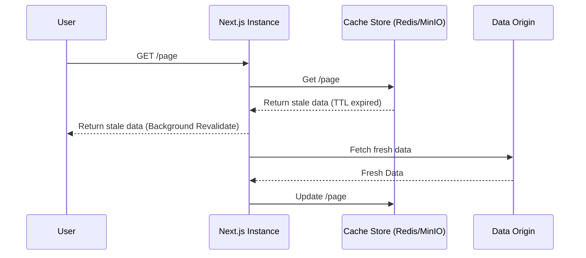
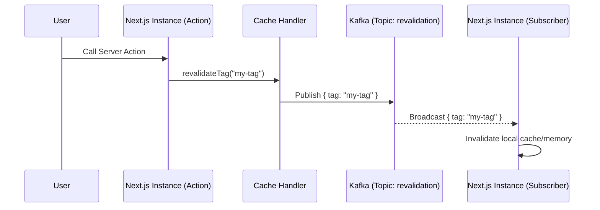
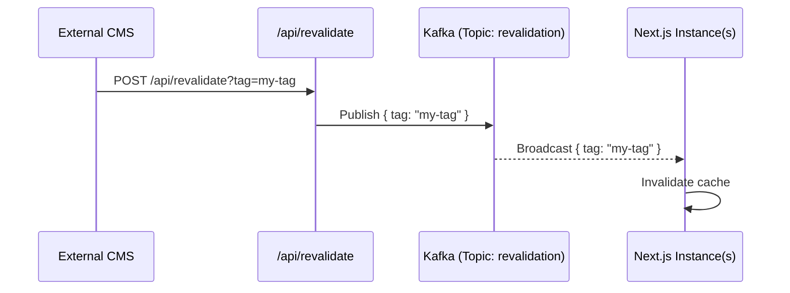

# ADR 0003: ISR Revalidation Routing

## Context
Next.js 16 Incremental Static Regeneration (ISR) requires a mechanism to propagate cache invalidation (revalidation) across multiple instances of the application. In our architecture, we use a custom `cache-handler.js` to manage the cache (potentially in Redis or MinIO). However, when a revalidation event occurs (e.g., `revalidateTag()`, `revalidatePath()`, or an external webhook), all instances need to be notified to ensure consistency or to trigger a background re-fetch.

## Options

### Option A: Cache Handler publishes directly to Kafka
The custom `cache-handler.js` implementation directly publishes revalidation events to a Kafka topic.

### Option B: API Route for Revalidation
An internal API route (e.g., `/api/revalidate`) is used to receive revalidation requests and then handle propagation.

### Option C: Both (Handler publishes to Kafka + API route for convenience)
The `cache-handler.js` publishes directly to Kafka for internal events (`revalidateTag`), and an API route is provided for external webhooks or manual triggers, which also publishes to Kafka.

## Decision
**Option C: Both (Handler publishes to Kafka + API route for convenience)**

We will implement a dual approach:
1. The `cache-handler.js` will include logic to publish revalidation events to Kafka whenever `revalidateTag` or `revalidatePath` is called.
2. An API route will be exposed to allow external systems to trigger revalidation via HTTP, which will also publish to the same Kafka topic.

## Rationale
- Publishing directly from the cache handler ensures that any server-side revalidation (like from Server Actions) is immediately and reliably propagated without extra internal network hops.
- Providing an API route offers a standardized way for external systems (CMS, webhooks) to trigger revalidation without needing Kafka producer capabilities.

## Sequence Diagrams

### 1. Stale Cache Hit


### 2. revalidateTag() from Server Action


### 3. External HTTP Webhook


## Cache Handler Interface (Next.js 16)
Next.js 16 expects a `cache-handler.js` to export a class (or a default function returning an object) that implements the following interface:

```javascript
// cache-handler.js
export default class CacheHandler {
  constructor(options) {
    this.options = options;
  }

  async get(key) {
    // Retrieve from store (Redis, MinIO, etc.)
    // Returns: Promise<{ lastModified: number, value: any, tags: string[] } | null>
  }

  async set(key, data, ctx) {
    // Store data with metadata
    // data: the value to store
    // ctx: { tags: string[], revalidate: number | false }
  }

  async revalidateTag(tag) {
    // Logic to propagate revalidation (e.g., publish to Kafka)
    // This is called when revalidateTag(tag) is invoked in the app
  }
}
```

## Consequences
- Requires a Kafka cluster to be available for ISR propagation.
- `cache-handler.js` must handle Kafka connection and error resilience.
- Increased complexity in the cache handler due to Kafka producer integration.

## Revisit triggers
- If Kafka introduces significant latency or overhead.
- If Next.js introduces a built-in multi-instance cache propagation mechanism.

## References
- [Next.js `cacheHandler` config](https://nextjs.org/docs/app/api-reference/config/next-config-js/cacheHandler) — the canonical extension point used by this ADR.
- [Next.js `revalidateTag`](https://nextjs.org/docs/app/api-reference/functions/revalidateTag) — server-side API that triggers the handler path.
- [Next.js `revalidatePath`](https://nextjs.org/docs/app/api-reference/functions/revalidatePath) — sibling API; same routing applies.
- [Issue #11][epic-11] — parent epic; this ADR is part of the vinext-deprecation migration.
- [ADR-0001](./0001-embed-manifest-strategy.md) — companion ADR (build pipeline).
- [ADR-0002](./0002-native-module-handling.md) — companion ADR (native modules).

[epic-11]: https://github.com/AhmedElBanna80/knext/issues/11
