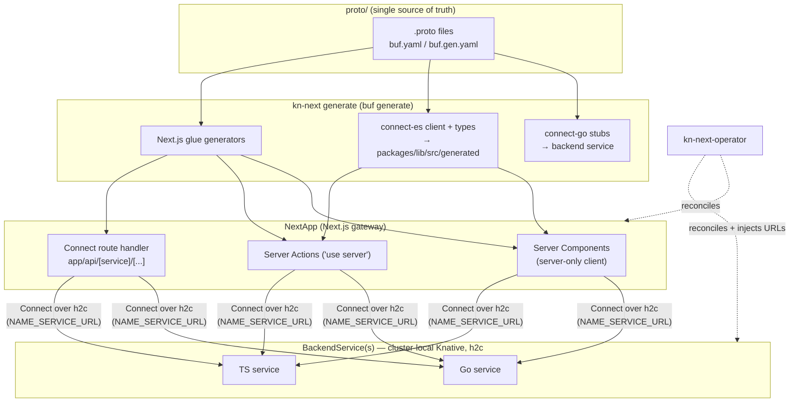

# Design: Polyglot gRPC Business-Logic Layer

> High-level design. Decisions in ADR-0002 (layer), ADR-0003 (Connect+buf), ADR-0004
> (`BackendService` CRD). **Design only — gated behind core maturity (Phase 6).**

## Goal
Let users run business logic as language-agnostic backend services (Go/TS first; Python/Rust
fast-follow) while **Next.js stays the HTTP gateway**. Contract-first Protobuf; CLI scaffolds
services + generates Next.js glue; each backend is a cluster-local scale-to-zero Knative service.

## Component diagram

## Contract & codegen model
- `proto/<service>/v1/*.proto` is authoritative. `buf lint` + `buf breaking` in CI enforce style
  and back-compat (proto package versioning `service.v1`).
- `kn-next generate` (new CLI command, mirrors `build.ts`/`deploy.ts`, reuses `shared.loadConfig`)
  runs `buf generate`. Outputs:
  - **Backend stubs** → into the scaffolded service (Go `connect-go`, TS `connect-es`).
  - **Client + message types** → `packages/lib/src/generated/` (gitignored, regenerated).
  - **Gateway glue** (generators):
    1. **server-only client wrappers** in `packages/lib/src/grpc-clients.ts` — singleton lazy
       init reading `<NAME>_SERVICE_URL` (exact pattern as `getDbPool`/`getMinioClient` in
       `clients.ts`), file starts with `import 'server-only'` (keeps gRPC client out of the
       browser bundle).
    2. **Server Actions** — `'use server'` wrappers per mutation RPC, calling the client and
       adding `revalidateTag(...)` (matches `apps/file-manager/src/app/actions.ts`).
    3. **JSON facade** — one catch-all `app/api/[service]/[...connect]/route.ts` mounting the
       Connect router (no per-route hand-rolling; browsers/3rd parties get JSON natively).
- **Drift detection**: `kn-next generate --check` fails if generated output differs from committed
  contract (CI gate), analogous to BUILD_ID sync in the adapter.

## Control / data flow (request)
1. Server Component or Action calls the generated **server-only** client.
2. Client dials `http://<name>.<ns>.svc.cluster.local` over **h2c** (Connect).
3. Knative routes to the `BackendService` revision (scaling from zero if idle).
4. Backend executes, returns; Action calls `revalidateTag` for cache coherence.
5. Browser/third-party callers hit the **Connect route handler** (JSON/HTTP) → same backend.

## Knative deployment model
- Each backend = `BackendService` CR → operator creates a Knative Service with a `h2c`-named
  port (`appProtocol: h2c`) and label `networking.knative.dev/visibility: cluster-local`
  (private; no public ingress → satisfies no-unauth-endpoint), least-privilege SA, owner refs.
- `NextApp.backends: [{name, service}]` → operator injects `<NAME>_SERVICE_URL` env into the
  gateway (same mechanism as `REDIS_URL`/`DATABASE_URL`).
- Backends inherit Fluid benefits: scale-to-zero, per-pod concurrency, `NODE_COMPILE_CACHE` (TS).

## Security
Cluster-local by default. Gateway→backend: Phase-1 shared bearer token via a generated Connect
interceptor (operator-provisioned secret) + NetworkPolicy; Phase-2 mTLS via mesh (follow-up ADR).

## Local dev
`buf generate` (watch) + `next dev` for the gateway + backends run locally (or on kind via the
operator). `kn-next generate` ergonomics: idempotent, `--check` for drift, scaffolds a runnable
service from `proto + --lang`.

## Versioning / back-compat
Proto `vN` packages; `buf breaking` against `main` in CI; generated artifacts never hand-edited.

## Pluggability
No backend? Everything stays in Next.js (status quo). Opt in by adding a `BackendService` + a
`proto/`. The boundary is the generated client interface — swap implementations/languages freely.
